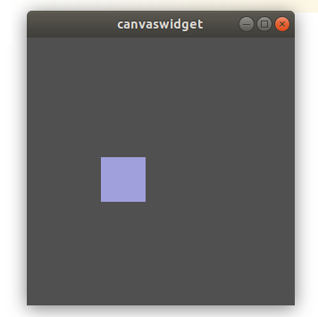
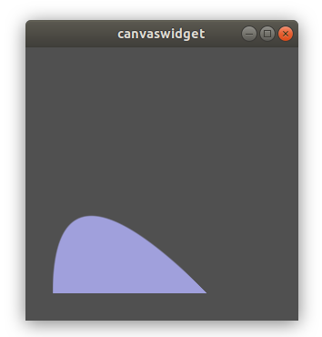

\page starter_page Getting started

# Basic widget example

Compile and run the Qt project [examples/canvaswidget/canvaswidget.pro](examples/simplewidget/simplewidget.pro)

The function paint() is where the drawing happens. A copy of the CanvasWidget paint() implementation is shown below:

\code
void CanvasWidget::paint( MxPainter &painter )
{
    const MxVector2F &areaSize = size(); // get window size
    MxRectF areaRect(areaSize);
    MxVectorDraw &paint = painter.vectorDraw(); // get SVG painter

    MxVector4UC bgColor(80, 80, 80, 255);
    MxVector4UC itemColor;
    if( pIsHovering ) { // pick square color
        itemColor = MxVector4UC(180, 180, 20, 255);
    } else {
        itemColor = MxVector4UC(160, 160, 220, 255);
    }

    paint.fillRect( areaRect, bgColor); // fill window with background color
    paint.fillRect( pDraggingRect, itemColor); // draw square
}
\endcode

**Now, lets modify the app and draw a rounded shape**

Mewa being a GPU based framework uses triangles to draw all geometries. 
We can use 2 filled triangles to draw a filled rectangle. But what if we want to draw a rounded corner rectangle?
How do we draw the rounded corners?

To draw curves Mewa uses, what we call, Mewa triangles.
These triangles draw anti-aliased filled curves inside them.

To draw a Mewa triangle we call MxVectorDraw::triangle(). The code below replaces
the last MxVectorDraw::fillRect() call with a MxVectorDraw::triangle() call.

\code
void CanvasWidget::paint( MxPainter &painter )
{
    const MxVector2F &areaSize = size();
    MxRectF areaRect(areaSize);
    MxVectorDraw &paint = painter.vectorDraw();

    MxVector4UC bgColor(80, 80, 80, 255);
    MxVector4UC itemColor;
    if( pIsHovering ) {
        itemColor = MxVector4UC(180, 180, 20, 255);
    } else {
        itemColor = MxVector4UC(160, 160, 220, 255);
    }

    paint.fillRect( areaRect, bgColor);

    // draw Mewa triangle
    MxVector2F a(30.0f, 30.0f);
    MxVector2F b(30.0f, 200.0f);
    MxVector2F c(200.0f, 30.0f);
    paint.triangle( a, itemColor,
                    b, itemColor,
                    c, itemColor,
                    MxVectorDraw::InnerCurveFill );
}
\endcode

The result is a filled curve as shown below.

See MxVectorDraw for more details about Mewa triangles.
